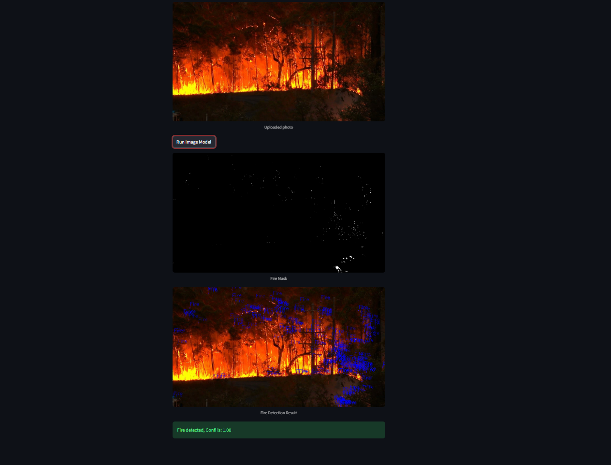
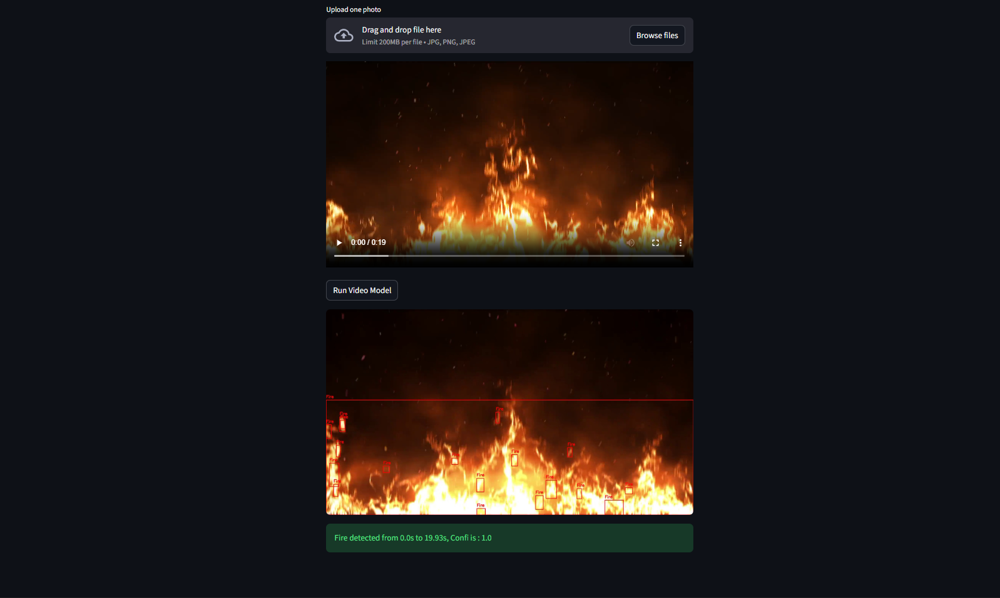

# Fire Detection AI Web App

A computer vision application that detects fire in images and videos using a Deep Learning model and OpenCV.

## Features
* **Image Detection:** Upload static images to predict fire presence and calculate confidence scores.
* **Video Analysis:** Process video files frame-by-frame, identifying fire zones over time.
* **Real-time Visualization:** Uses OpenCV to draw bounding boxes around detected fire using HSV color masking.
* **Web Interface:** Built with Streamlit for easy file uploading and result display.

## Tech Stack
* **Language:** Python
* **AI/ML:** TensorFlow, Keras
* **Computer Vision:** OpenCV (cv2)
* **Dashboard:** Streamlit

## Project Structure
* `main.py`: Core logic for video/image processing and Streamlit UI.
* `model.h5`: Pre-trained CNN model for fire classification.
* `requirements.txt`: List of necessary Python libraries.

## 📺 Demo

*Figure 1: Interface showing fire detection with bounding boxes and confidence scores.*

*Figure 2: Inference result on a sample forest fire image*

*Figure 3: Video Inference Process*